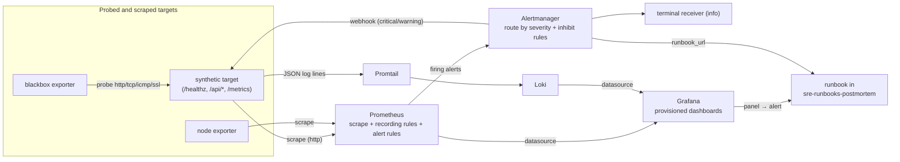

# sre-observability-stack

A complete observability stack as code: Prometheus, Alertmanager, Grafana, Loki, Promtail, blackbox exporter and node exporter, with provisioned dashboards, SLO burn-rate alerting and a synthetic workload the repository probes itself.

[](https://github.com/dayxus/sre-observability-stack/actions/workflows/ci.yml)
[](LICENSE)
[](pyproject.toml)

## What it does

- Brings up eight containers with one command (`scripts/up.sh` → `docker compose up -d --wait`): nothing is configured by hand in a UI afterwards.
- Scrapes node exporter, the blackbox exporter (http/tcp/icmp/ssl probes), Loki, Alertmanager, Prometheus itself and a synthetic target that ships in this repository.
- Records the SLIs and computes multi-window burn rates (`prometheus/rules/recording.rules.yml`), then alerts on them with the Google SRE Workbook recipe: a short window catches the change, a long window proves it is not a blip.
- Ships three dashboards from `grafana/dashboards/*.json`, provisioned read-only through `grafana/provisioning/`, with Prometheus and Loki as provisioned datasources.
- Collects container and application logs with Promtail into Loki, with a JSON pipeline that parses the target's log lines.
- Proves itself twice: `scripts/validate.sh` validates every config without a cluster, and `scripts/smoke.sh` (run in CI against the live stack) asserts that all scrape targets are `up`, the dashboards are provisioned and an alert posted through the Alertmanager API really reaches the webhook receiver.

### Dashboards: what each panel answers

Every panel exists because a question exists; the full reasoning for each one is in [`docs/dashboards.md`](docs/dashboards.md).

| Panel | Operational question | Metric / source |
| --- | --- | --- |
| Error budget remaining (30d) | How much of the 30 day availability budget do we still have? | `slo:availability:budget_remaining_ratio` over `probe_success` |
| Availability SLI (5m) | Is the service available right now, and how far from the 99.5% objective? | `probe_success` (blackbox http probe) |
| Burn rate (5m) | Are we spending budget faster than the objective allows right now? | `slo:burn_rate:5m` |
| Burn rate — short against long window | Is this a spike or a sustained trend? | `slo:burn_rate:{5m,30m,1h,6h,1d}` |
| Alerts firing right now | Is anything actually alerting while I look at this? | `ALERTS` |
| Availability SLI by probe job | Which probe layer is failing when the average still looks fine? | `lab:probe:success_rate5m` |
| Latency SLI — requests served under 300 ms | Are we inside the latency objective across 5m, 1h, 6h and 1d? | `slo:latency:ratio_rate{5m,1h,6h,1d}` |
| Burn rate by window | Which window is burning, so I can pick the matching alert and runbook? | `slo:burn_rate:{5m,30m,1h,2h,6h,1d,3d}` |
| Traffic — request rate by path | How much traffic is the workload serving, and which endpoint dominates? | `lab:requests:rate5m` |
| Errors — 5xx ratio by path | Which endpoint is returning errors, and is it the injected one? | `lab:errors:ratio_rate5m` |
| Latency — p50, p95 and p99 | What does the tail look like, not just the average? | `histogram_quantile` over the target's duration histogram |
| Requests in flight | Is concurrency rising while throughput is flat? | `synthetic_http_inflight_requests` |
| Saturation — node CPU busy | Is the node running out of CPU headroom? | `node_cpu_seconds_total` |
| Saturation — root filesystem used | Will the TSDB or the Loki chunks run out of disk? | `node_filesystem_{avail,size}_bytes` |
| Probes up / Probes configured | How many probe layers are green, and did a job silently disappear? | `probe_success` |
| Certificate expires in (days) | When does the TLS chain break? | `probe_ssl_earliest_cert_expiry` |
| HTTP phase breakdown | Is the time going to DNS, connect, TLS, processing or transfer? | `probe_http_duration_seconds` by `phase` |
| Probe results — current state | One table to read during an incident: every probe, every target, now? | `probe_success` |

## Why it matters for SRE

An SLO is only worth what its measurement is worth, so this stack starts from the measurement: an external probe for availability, the workload's own histogram for latency, both recorded as versioned rules. The alerting follows from the error budget instead of from a hand-picked threshold, and every alert carries the `runbook_url` an on-call would need, because an alert without a runbook is toil for whoever is paged. Because the whole stack is files, it is reviewable in a pull request and a broken dashboard, a hardcoded datasource or a rule referencing a metric that does not exist fails CI instead of failing an incident.

## Architecture



The alert path is closed inside the lab on purpose: Alertmanager delivers to the synthetic target's `/alerts` endpoint, so `scripts/smoke.sh` can assert that a notification really travelled route tree → receiver → HTTP POST.

## Quickstart

Needs Docker with Compose v2 and, for the test suite, Python ≥ 3.9.

```bash
git clone https://github.com/dayxus/sre-observability-stack.git
cd sre-observability-stack

make setup     # create .venv with pytest, jsonschema, PyYAML and ruff
make test      # 71 tests, no Docker needed

cp .env.example .env
make up        # generates the lab TLS material, waits for every healthcheck
make smoke     # asserts targets, probes, recording rules, alerts, dashboards, logs
open http://localhost:3000   # admin / lab-admin (set GF_ADMIN_PASSWORD in .env)
make down      # stop the stack and remove its volumes
```

Endpoints: Prometheus `:9090`, Alertmanager `:9093`, Grafana `:3000`, Loki `:3100`, Promtail `:9080`, blackbox exporter `:9115`, node exporter `:9100`, synthetic target `:8080` (HTTP) and `:8443` (HTTPS).

## Verify it yourself

```bash
make test        # contract tests: dashboards, compose, Prometheus configs, target behaviour
make validate    # promtool + amtool + loki + promtail + pytest, no cluster required
make smoke       # only against a running stack
```

`scripts/validate.sh` downloads the pinned `promtool`, `amtool`, `loki` and `promtail` releases into `.tools/` and runs them against this repository's configs. Output from a run on macOS (Python 3.9.6, Docker absent, which is the case the script is expected to survive):

```text
validating sre-observability-stack
platform: darwin-arm64   python: Python 3.9.6

[1/5] prometheus: promtool check config + check rules
  promtool, version 3.14.0 (branch: HEAD, revision: d7598b7141418fa35be2b5ec5d0fefb634199610)
Checking /Users/jefersonmelo/Projects/github-portfolio/sre-observability-stack/prometheus/prometheus.yml
  SUCCESS: 3 rule files found
 SUCCESS: /Users/jefersonmelo/Projects/github-portfolio/sre-observability-stack/prometheus/prometheus.yml is valid prometheus config file syntax

Checking /Users/jefersonmelo/Projects/github-portfolio/sre-observability-stack/prometheus/rules/recording.rules.yml
  SUCCESS: 27 rules found

Checking /Users/jefersonmelo/Projects/github-portfolio/sre-observability-stack/prometheus/rules/slo-burnrate.rules.yml
  SUCCESS: 7 rules found

Checking /Users/jefersonmelo/Projects/github-portfolio/sre-observability-stack/prometheus/rules/host.rules.yml
  SUCCESS: 10 rules found

  ok: scrape config, alerting config and 3 rule files are valid

[2/5] alertmanager: amtool check-config
  amtool, version 0.34.0 (branch: HEAD, revision: 085f0ef7eb41da24cab8cd000f1345b6250f2edb)
Checking '/Users/jefersonmelo/Projects/github-portfolio/sre-observability-stack/alertmanager/alertmanager.yml'  SUCCESS
Found:
 - global config
 - route
 - 2 inhibit rules
 - 2 receivers
 - 0 templates

  ok: route tree, receivers and inhibit rules are valid

[3/5] loki and promtail: config validation with the release binaries
  level=info ts=2026-09-16T00:52:08.498669Z caller=main.go:109 msg="config is valid"
  ok: loki config verified by loki 3.7.7
Valid config file! No syntax issues found
  ok: promtail config syntax checked by promtail 3.6.11

[4/5] python tests: pytest (dashboards, compose, prometheus configs, synthetic target)
  using /Users/jefersonmelo/Projects/github-portfolio/sre-observability-stack/.venv/bin/python
.......................................................................  [100%]
71 passed in 0.92s

[5/5] docker compose config (needs docker; this step is skipped without it)
  skipped: docker not found, skipping compose validation

validation finished: promtool, amtool, loki, promtail and pytest all green
```

The second half of the evidence is the CI smoke job, which runs against the real stack on an Ubuntu runner. See [`docs/smoke-evidence.md`](docs/smoke-evidence.md) for the literal output of the last run (targets `up`, dashboards provisioned, alert delivered, logs shipped) and for the uploaded `smoke-evidence` artifact.

## Automated maintenance

`.github/workflows/maintenance.yml` runs every Monday at 06:00 UTC (and on demand):

1. Queries the upstream release APIs (GitHub Releases for Prometheus, Alertmanager, Loki, Grafana; the registry tag lists for the rest) and compares every component with `versions.env`.
2. Rewrites `docs/versions.md` and `reports/weekly-audit.md` and commits only when the diff is real (`git diff --quiet && exit 0`).
3. Opens an issue instead of bumping when a new **major** is available, or when a component could not be reached, so a human decides with the changelog in hand.
4. Re-runs `promtool` from the newest Prometheus release against these rule files and reports any rule the new version rejects.
5. Runs `scripts/validate.sh` as the regression gate and attaches the tail of the output to the issue it opens on failure.

The point is drift detection, not unattended upgrades: pins move in a reviewed commit, and a weekly job that finds nothing leaves the repository unchanged.

## Project layout

```text
docker-compose.yml                 # 8 services: healthchecks, condition-based depends_on, limits
versions.env                       # pinned image tags (single source of truth)
.env.example                       # ports, Grafana credentials, lab knobs
Makefile                           # setup, test, lint, validate, up, down, smoke, versions
prometheus/
  prometheus.yml                   # scrape jobs: node, blackbox (http/tcp/icmp/ssl), loki, self
  rules/recording.rules.yml        # SLIs and burn rates
  rules/slo-burnrate.rules.yml     # multi-window burn-rate alerts
  rules/host.rules.yml             # CPU, memory, disk, restarts, certificate expiry
alertmanager/alertmanager.yml      # route tree by severity, group_by, inhibit rules
blackbox/blackbox.yml              # http_2xx, tcp_connect, icmp_ping, ssl_expiry modules
loki/loki-config.yml               # single binary, filesystem storage, bounded retention
promtail/promtail-config.yml       # docker service discovery + JSON log pipeline
grafana/
  provisioning/                    # datasources (Prometheus, Loki) + dashboard provider
  dashboards/                      # slo-overview, golden-signals, blackbox-probes
schemas/grafana-dashboard.schema.json   # subset JSON Schema for the dashboards
synthetic/target/target_server.py  # the workload: metrics, TLS, log lines, alert sink
scripts/                           # validate.sh, smoke.sh, up.sh, down.sh, gen-certs.sh
tests/                             # contract tests for compose, configs, dashboards, target
docs/                              # dashboards.md, slo-alerts.md, versions.md
.github/workflows/                 # ci.yml (lint, validate matrix, smoke), maintenance.yml
```

## Limitations and next steps

- **The lab stack only runs with Docker.** `scripts/validate.sh` keeps working without it (it prints `docker not found, skipping compose validation`), but `make up` and `make smoke` need a Docker host; that is why the smoke job runs in CI.
- **The long windows are not proven.** The `1d`, `3d` and `30d` burn rates and the 30-day budget only become meaningful with 30 days of retention. A CI run lasts minutes, so the smoke test asserts the short windows, that the recording rules evaluate and that the alert path delivers — never a long-window value.
- **The workload is synthetic.** Availability is a self-signed HTTPS endpoint, latency comes from a simulated endpoint that always spends 280 ms, and the objectives (99.5% / 99.0%) are lab values, not objectives derived from real traffic history.
- **Alerts reach a sink, not a human.** Delivery is proven end to end, but the receiver is the synthetic target's `/alerts` endpoint. Swapping in a real receiver (PagerDuty, Slack, email) is a two-line change in `alertmanager/alertmanager.yml`, and no credential is committed today.
- **Single node, no cluster.** The stack runs with Compose on one host; there is no Kubernetes, no HA Prometheus pair, no long-term remote storage and no multi-tenant Grafana. Kubernetes ServiceMonitor/mimir-style deployments are the natural next step.
- **No image build of its own.** Every container is an upstream image pinned in `versions.env`; the only code this repository runs is the synthetic target.

---

[Português (pt-BR)](README.pt-BR.md) · Part of the [dayxus SRE portfolio](https://github.com/dayxus).
