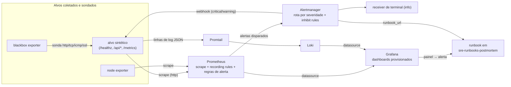

# sre-observability-stack

Stack de observabilidade completa como código: Prometheus, Alertmanager, Grafana, Loki, Promtail, blackbox exporter e node exporter, com dashboards provisionados, alertas de burn rate ligados a SLO e uma carga sintética que o próprio repositório monitora.

[](https://github.com/dayxus/sre-observability-stack/actions/workflows/ci.yml)
[](LICENSE)
[](pyproject.toml)

## O que faz

- Sobe oito contêineres com um comando (`scripts/up.sh` → `docker compose up -d --wait`): depois disso nada é configurado na mão pela interface.
- Coleta métricas do node exporter, do blackbox exporter (sondas http/tcp/icmp/ssl), do Loki, do Alertmanager, do próprio Prometheus e de um alvo sintético que vive neste repositório.
- Grava os SLIs e calcula burn rate em múltiplas janelas (`prometheus/rules/recording.rules.yml`) e alerta a partir delas com a receita do SRE Workbook: uma janela curta pega a mudança, uma janela longa confirma que não é ruído.
- Entrega três dashboards de `grafana/dashboards/*.json`, provisionados somente-leitura via `grafana/provisioning/`, com Prometheus e Loki como datasources provisionados.
- Envia logs de contêineres e da aplicação com o Promtail para o Loki, com pipeline JSON que interpreta as linhas de log do alvo.
- Se prova duas vezes: `scripts/validate.sh` valida toda a configuração sem cluster e `scripts/smoke.sh` (rodado no CI contra a stack viva) verifica que todos os alvos de scrape estão `up`, que os dashboards foram provisionados e que um alerta postado pela API do Alertmanager realmente chega ao receptor webhook.

### Dashboards: o que cada painel responde

Cada painel existe porque existe uma pergunta; o raciocínio completo de cada um está em [`docs/dashboards.md`](docs/dashboards.md).

| Painel | Pergunta operacional | Métrica / fonte |
| --- | --- | --- |
| Error budget remaining (30d) | Quanto do error budget de 30 dias ainda temos? | `slo:availability:budget_remaining_ratio` sobre `probe_success` |
| Availability SLI (5m) | O serviço está disponível agora, e a que distância do objetivo de 99,5%? | `probe_success` (sonda http do blackbox) |
| Burn rate (5m) | Estamos gastando budget mais rápido do que o objetivo permite neste momento? | `slo:burn_rate:5m` |
| Burn rate — short against long window | É um pico pontual ou uma tendência sustentada? | `slo:burn_rate:{5m,30m,1h,6h,1d}` |
| Alerts firing right now | Existe alerta disparado enquanto estou olhando? | `ALERTS` |
| Availability SLI by probe job | Qual camada de sonda está falhando quando a média ainda parece boa? | `lab:probe:success_rate5m` |
| Latency SLI — requests served under 300 ms | Estamos dentro do objetivo de latência em 5m, 1h, 6h e 1d? | `slo:latency:ratio_rate{5m,1h,6h,1d}` |
| Burn rate by window | Qual janela está queimando, para eu escolher o alerta e o runbook certos? | `slo:burn_rate:{5m,30m,1h,2h,6h,1d,3d}` |
| Traffic — request rate by path | Quanto tráfego a carga atende, e qual endpoint domina? | `lab:requests:rate5m` |
| Errors — 5xx ratio by path | Qual endpoint está devolvendo erro, e é o de injeção de falha? | `lab:errors:ratio_rate5m` |
| Latency — p50, p95 e p99 | Como está a cauda, não apenas a média? | `histogram_quantile` sobre o histograma de duração do alvo |
| Requests in flight | A concorrência está subindo com a vazão estável? | `synthetic_http_inflight_requests` |
| Saturation — node CPU busy | Sobra CPU no nó? | `node_cpu_seconds_total` |
| Saturation — root filesystem used | O TSDB ou os chunks do Loki vão ficar sem disco? | `node_filesystem_{avail,size}_bytes` |
| Probes up / Probes configured | Quantas camadas de sonda estão verdes, e alguma sumiu da configuração? | `probe_success` |
| Certificate expires in (days) | Quando a cadeia TLS quebra? | `probe_ssl_earliest_cert_expiry` |
| HTTP phase breakdown | O tempo está indo para DNS, connect, TLS, processamento ou transferência? | `probe_http_duration_seconds` por `phase` |
| Probe results — current state | Uma tabela para ler durante o incidente: cada sonda, cada alvo, agora? | `probe_success` |

## Por que isso importa em SRE

Um SLO vale o que vale a sua medição, então esta stack começa pela medição: uma sonda externa para disponibilidade e o histograma da própria aplicação para latência, ambos gravados como regras versionadas. O alerta vem do error budget, não de um limiar escolhido no olho, e todo alerta carrega o `runbook_url` que o plantonista vai precisar, porque alerta sem runbook é toil para quem for acordado. Como a stack inteira são arquivos, ela é revisável em pull request: dashboard quebrado, datasource fixo no código ou regra que cita métrica inexistente reprova o CI em vez de reprovar em incidente.

## Arquitetura



O caminho do alerta se fecha dentro do laboratório de propósito: o Alertmanager entrega no endpoint `/alerts` do alvo sintético, então o `scripts/smoke.sh` consegue provar que a notificação percorreu rota → receiver → POST HTTP.

## Começando

Precisa de Docker com Compose v2 e, para a suíte de testes, Python ≥ 3.9.

```bash
git clone https://github.com/dayxus/sre-observability-stack.git
cd sre-observability-stack

make setup     # cria o .venv com pytest, jsonschema, PyYAML e ruff
make test      # 71 testes, sem Docker

cp .env.example .env
make up        # gera o material TLS do laboratório e espera todos os healthchecks
make smoke     # verifica alvos, sondas, recording rules, alertas, dashboards e logs
open http://localhost:3000   # admin / lab-admin (defina GF_ADMIN_PASSWORD no .env)
make down      # para a stack e remove os volumes
```

Endpoints: Prometheus `:9090`, Alertmanager `:9093`, Grafana `:3000`, Loki `:3100`, Promtail `:9080`, blackbox exporter `:9115`, node exporter `:9100`, alvo sintético `:8080` (HTTP) e `:8443` (HTTPS).

## Verifique você mesmo

```bash
make test        # testes de contrato: dashboards, compose, configs do Prometheus, comportamento do alvo
make validate    # promtool + amtool + loki + promtail + pytest, sem precisar de cluster
make smoke       # somente contra uma stack no ar
```

O `scripts/validate.sh` baixa as versões fixadas de `promtool`, `amtool`, `loki` e `promtail` para `.tools/` e roda cada uma contra a configuração deste repositório. Saída de uma execução no macOS (Python 3.9.6, sem Docker — justamente o caso que o script precisa sobreviver):

```text
validating sre-observability-stack
platform: darwin-arm64   python: Python 3.9.6

[1/5] prometheus: promtool check config + check rules
  promtool, version 3.14.0 (branch: HEAD, revision: d7598b7141418fa35be2b5ec5d0fefb634199610)
Checking /Users/jefersonmelo/Projects/github-portfolio/sre-observability-stack/prometheus/prometheus.yml
  SUCCESS: 3 rule files found
 SUCCESS: /Users/jefersonmelo/Projects/github-portfolio/sre-observability-stack/prometheus/prometheus.yml is valid prometheus config file syntax

Checking /Users/jefersonmelo/Projects/github-portfolio/sre-observability-stack/prometheus/rules/recording.rules.yml
  SUCCESS: 27 rules found

Checking /Users/jefersonmelo/Projects/github-portfolio/sre-observability-stack/prometheus/rules/slo-burnrate.rules.yml
  SUCCESS: 7 rules found

Checking /Users/jefersonmelo/Projects/github-portfolio/sre-observability-stack/prometheus/rules/host.rules.yml
  SUCCESS: 10 rules found

  ok: scrape config, alerting config and 3 rule files are valid

[2/5] alertmanager: amtool check-config
  amtool, version 0.34.0 (branch: HEAD, revision: 085f0ef7eb41da24cab8cd000f1345b6250f2edb)
Checking '/Users/jefersonmelo/Projects/github-portfolio/sre-observability-stack/alertmanager/alertmanager.yml'  SUCCESS
Found:
 - global config
 - route
 - 2 inhibit rules
 - 2 receivers
 - 0 templates

  ok: route tree, receivers and inhibit rules are valid

[3/5] loki and promtail: config validation with the release binaries
  level=info ts=2026-09-16T00:52:08.498669Z caller=main.go:109 msg="config is valid"
  ok: loki config verified by loki 3.7.7
Valid config file! No syntax issues found
  ok: promtail config syntax checked by promtail 3.6.11

[4/5] python tests: pytest (dashboards, compose, prometheus configs, synthetic target)
  using /Users/jefersonmelo/Projects/github-portfolio/sre-observability-stack/.venv/bin/python
.......................................................................  [100%]
71 passed in 0.92s

[5/5] docker compose config (needs docker; this step is skipped without it)
  skipped: docker not found, skipping compose validation

validation finished: promtool, amtool, loki, promtail and pytest all green
```

A outra metade da evidência é o job de smoke do CI, que roda contra a stack de verdade num runner Ubuntu. A saída literal da última execução (alvos `up`, dashboards provisionados, alerta entregue, logs chegando ao Loki) está em [`docs/smoke-evidence.md`](docs/smoke-evidence.md), junto com o artefato `smoke-evidence` publicado pelo workflow.

## Manutenção automatizada

O `.github/workflows/maintenance.yml` roda toda segunda-feira às 06:00 UTC (e sob demanda):

1. Consulta as APIs de release upstream (GitHub Releases para Prometheus, Alertmanager, Loki e Grafana; listas de tags do registry para o resto) e compara cada componente com o `versions.env`.
2. Reescreve `docs/versions.md` e `reports/weekly-audit.md` e só commita quando o diff é real (`git diff --quiet && exit 0`).
3. Abre issue em vez de subir a tag quando existe um **major** novo, ou quando algum componente não respondeu, para que a decisão seja humana e com o changelog na mão.
4. Roda o `promtool` da release mais nova do Prometheus contra estas regras e reporta qualquer regra que a versão nova rejeite.
5. Usa o `scripts/validate.sh` como portão de regressão e anexa o final da saída à issue que abre em caso de falha.

O objetivo é detectar drift, não atualizar sozinho: os pinos mudam em commit revisado, e um job semanal que não encontra nada deixa o repositório intacto.

## Estrutura do projeto

```text
docker-compose.yml                 # 8 serviços: healthchecks, depends_on por condição, limites
versions.env                       # tags fixadas das imagens (fonte única da verdade)
.env.example                       # portas, credenciais do Grafana, ajustes do laboratório
Makefile                           # setup, test, lint, validate, up, down, smoke, versions
prometheus/
  prometheus.yml                   # jobs: node, blackbox (http/tcp/icmp/ssl), loki, self
  rules/recording.rules.yml        # SLIs e burn rates
  rules/slo-burnrate.rules.yml     # alertas de burn rate em múltiplas janelas
  rules/host.rules.yml             # CPU, memória, disco, reinício, expiração de certificado
alertmanager/alertmanager.yml      # árvore de rotas por severidade, group_by, inhibit rules
blackbox/blackbox.yml              # módulos http_2xx, tcp_connect, icmp_ping, ssl_expiry
loki/loki-config.yml               # binário único, storage em filesystem, retenção limitada
promtail/promtail-config.yml       # service discovery do Docker + pipeline de log JSON
grafana/
  provisioning/                    # datasources (Prometheus, Loki) + provider de dashboards
  dashboards/                      # slo-overview, golden-signals, blackbox-probes
schemas/grafana-dashboard.schema.json   # JSON Schema (subset) dos dashboards
synthetic/target/target_server.py  # a carga: métricas, TLS, linhas de log, sink de alertas
scripts/                           # validate.sh, smoke.sh, up.sh, down.sh, gen-certs.sh
tests/                             # testes de contrato de compose, configs, dashboards, alvo
docs/                              # dashboards.md, slo-alerts.md, versions.md
.github/workflows/                 # ci.yml (lint, matriz de validate, smoke), maintenance.yml
```

## Limitações e próximos passos

- **A stack do laboratório só roda com Docker.** O `scripts/validate.sh` continua funcionando sem ele (imprime `docker not found, skipping compose validation`), mas `make up` e `make smoke` precisam de um host Docker; por isso o job de smoke roda no CI.
- **As janelas longas não estão provadas.** Os burn rates de `1d`, `3d` e `30d` e o budget de 30 dias só passam a significar algo com 30 dias de retenção. Uma execução de CI dura minutos, então o smoke verifica as janelas curtas, que as recording rules são avaliadas e que o caminho do alerta entrega — nunca um valor de janela longa.
- **A carga é sintética.** A disponibilidade é um endpoint HTTPS autoassinado, a latência vem de um endpoint simulado que sempre gasta 280 ms, e os objetivos (99,5% / 99,0%) são valores de laboratório, não objetivos derivados de histórico de tráfego real.
- **O alerta chega a um sink, não a uma pessoa.** A entrega é provada de ponta a ponta, mas o receptor é o endpoint `/alerts` do alvo sintético. Trocar por um receptor real (PagerDuty, Slack, e-mail) são duas linhas em `alertmanager/alertmanager.yml`, e hoje nenhuma credencial está versionada.
- **Nó único, sem cluster.** A stack roda com Compose em um host; não há Kubernetes, nem par de Prometheus em HA, nem storage remoto de longo prazo, nem Grafana multi-tenant. ServiceMonitor/mimir são o próximo passo natural.
- **Nenhuma imagem própria é construída.** Todo contêiner é imagem upstream fixada no `versions.env`; o único código deste repositório que roda é o alvo sintético.

---

[English](README.md) · Part of the [dayxus SRE portfolio](https://github.com/dayxus).
